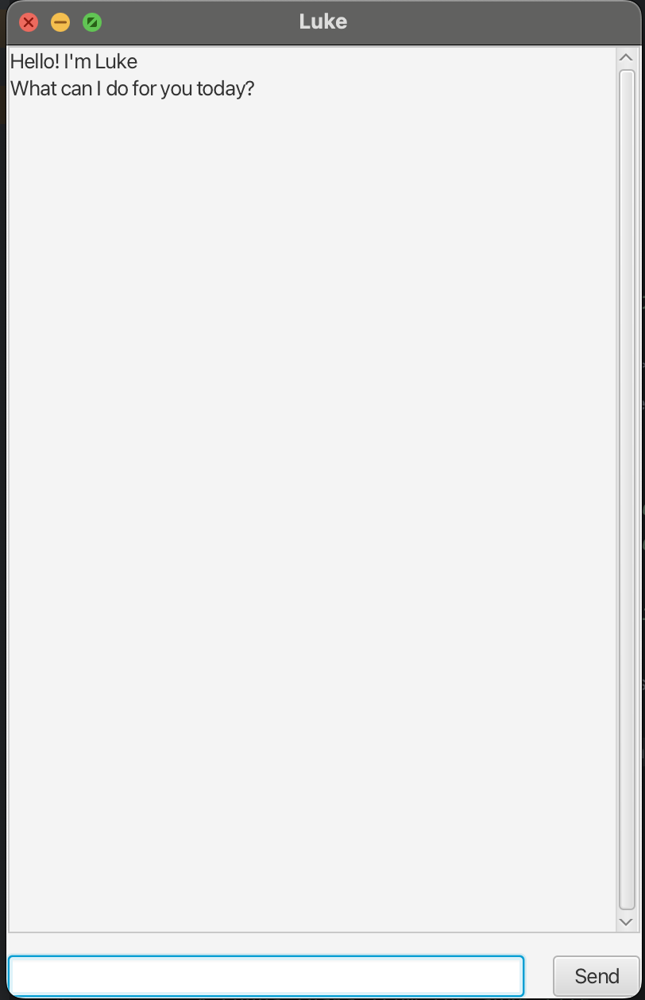

# Luke User Guide

Luke is a simple task management chatbot that helps you manage your to-dos, deadlines, and events.

## Features

### Managing Tasks

* **List** - View all your tasks
    * Example: `list`

* **Todo** - Simple tasks without specific times
    * Example: `todo read book`

* **Deadline** - Add a task with a due date
    * Example: `deadline assignment /by 15/3/2025 1800`

* **Event** - Add a task with a timeframe
    * Example: `event meeting /from 20/3/2025 1400 /to 1600`

* **Mark/Unmark** - Toggle task completion
    * Examples:
        * `mark 1`
        * `unmark 2`

* **Delete** - Remove a task
    * Example: `delete 3`

* **Find** - Search for tasks
    * Example: `find book`

* **Sort** - Arrange tasks by different criteria
    * Examples:
        * `sort date`
        * `sort description`
        * `sort type`

### Exiting

* **Bye** - Exit the application
    * Example: `bye`

## Error Handling

Luke handles common errors:
* Invalid commands will prompt you with the correct format
* Missing files will be handled automatically
* Invalid task numbers will be detected and reported